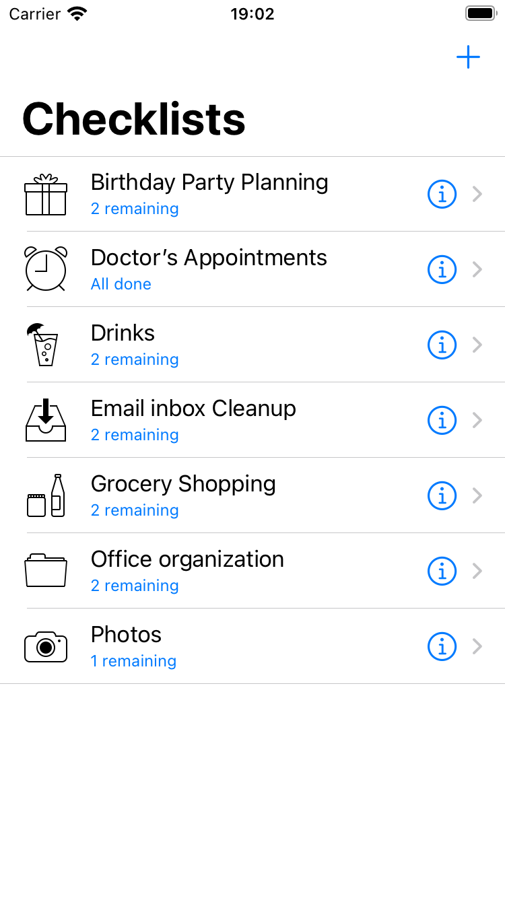
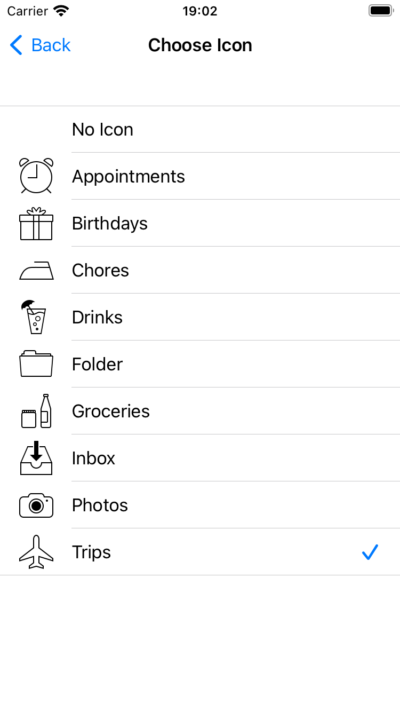
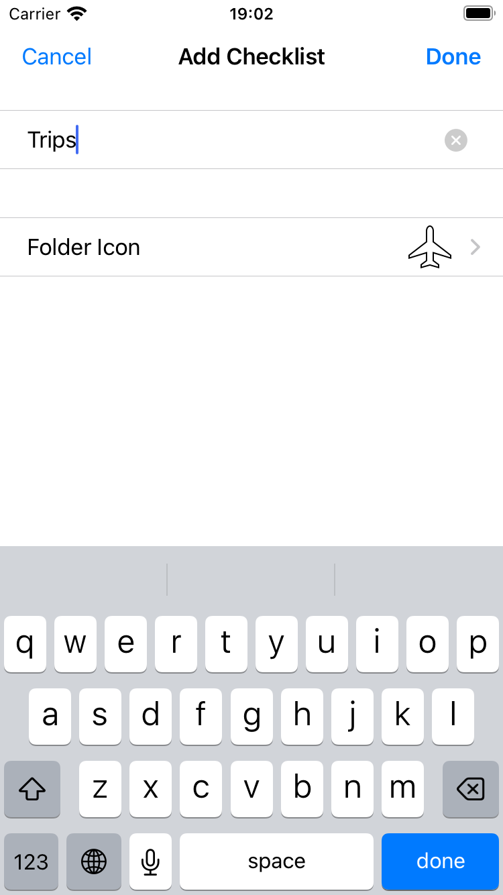
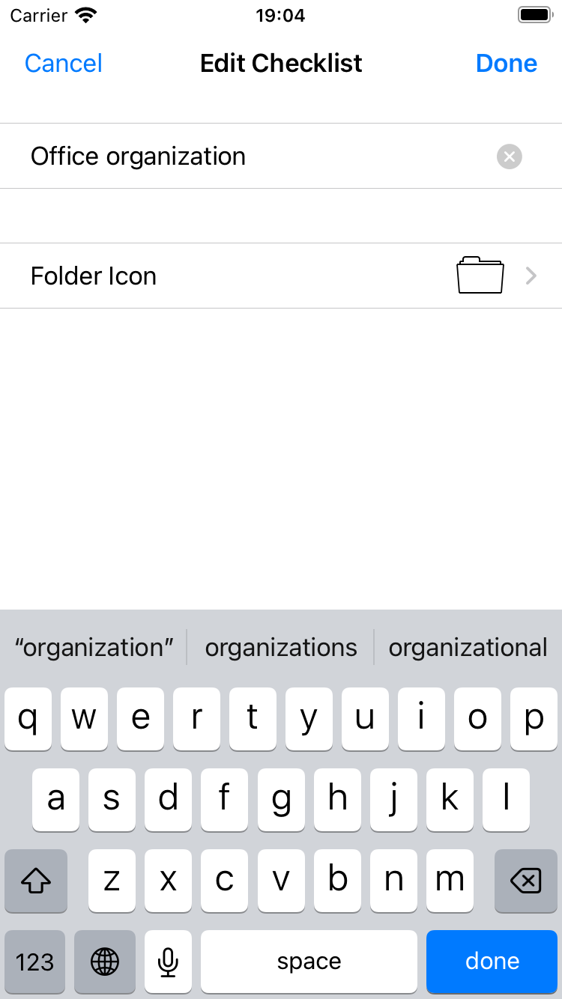

# Checklist Manager 📋
### Created by Bakhrom Usmanov

Welcome to **Checklist Manager**, an app designed to help users efficiently organize and manage their tasks through intuitive checklists and to-do items.

## 📱 What the App Can Do:

### 1. **Create and manage checklists**:
   - Users can create multiple checklists to organize to-do items.
   - Each checklist has a name, an icon, and can contain zero or more to-do items.
   - Users can edit the name and icon of any checklist.

### 2. **Manage to-do items**:
   - Each to-do item includes a description, a checkmark to indicate its completion, and an optional due date.
   - Users can edit the details of a to-do item to update its content.

### 3. **Reminders for to-do items**:
   - Users can set reminders for specific to-do items with deadlines.
   - The app will notify users about their reminders, even if it’s not running, using iOS notifications.

### 4. **View and interact with checklists**:
   - Users can tap on a checklist’s name to view its to-do items in detail.
   - Check off items as completed by marking them with a checkmark to track progress.

## 🖼️ Screenshots

## 🚀 Features
- **Customizable checklists**: Choose unique names and icons for your checklists to better organize your tasks.
- **To-do management**: Add, edit, or delete items, and track your progress with the checkmark system.
- **Reminders and notifications**: Never miss a task again with built-in reminders and iOS notifications.
- **Simple and intuitive UI**: Interact with your lists and items in an easy-to-navigate interface.
